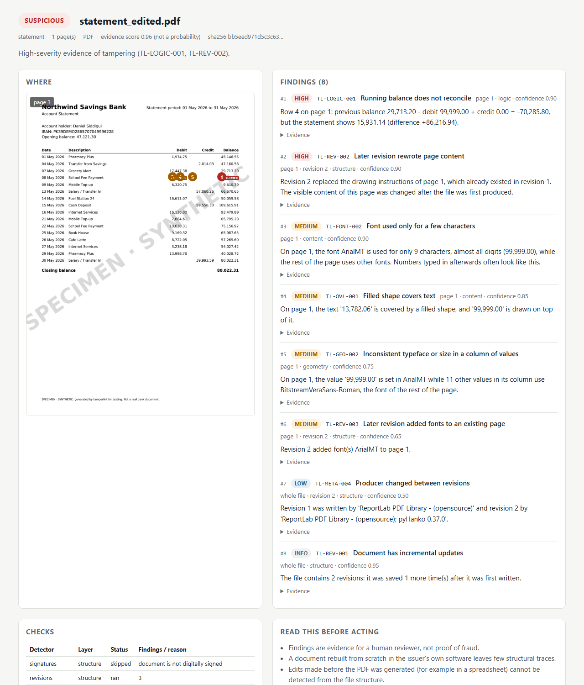

<h1 align="center">tamperlint</h1>

<p align="center">
  <b>Explainable tamper detection for PDFs and scanned documents.</b><br>
  A linter for document authenticity: file structure, fonts, layout, pixels and arithmetic, with a
  plain-language reason for every finding.
</p>

<p align="center">
  <a href="https://github.com/muneeb9211/tamperlint/actions/workflows/ci.yml"></a>
  
  <a href="LICENSE"></a>
</p>

<p align="center"><b><a href="https://muneeb9211.github.io/tamperlint/">See the example reports</a></b>: edited statements, an inflated invoice and
copied scan rows, each finding explained.</p>

<p align="center"><a href="https://muneeb9211.github.io/tamperlint/reports/statement_edited.html"></a></p>

Edited bank statements, altered salary slips, changed grades and inflated invoices reach lenders,
insurers, universities and HR teams every day, and most are still checked by eye. tamperlint
looks at a document the way a forensic examiner would and tells you **what** looks wrong,
**where**, and **why** (output abridged):

```text
SUSPICIOUS  statement_edited.pdf  |  statement | 1 page(s) | evidence 0.96
high    TL-LOGIC-001  p.1        Row 4: previous balance 29,713.20 - debit 99,999.00 + credit 0.00
                                 = -70,285.80, but the statement shows 15,931.14.
high    TL-REV-002    p.1 rev 2  Revision 2 replaced the drawing instructions of page 1, which
                                 already existed in revision 1.
medium  TL-FONT-002   p.1        The font ArialMT is used for only 9 characters, almost all
                                 digits (99,999.00), while the rest of the page uses other fonts.
medium  TL-OVL-001    p.1        The text '13,782.06' is covered by a filled shape, and
                                 '99,999.00' is drawn on top of it.
medium  TL-GEO-002    p.1        '99,999.00' is set in ArialMT while 11 other values in its
                                 column use BitstreamVeraSans-Roman, the font of the rest of the page.
```

- **Runs anywhere.** A pip-installable Python package (with prebuilt wheels for its native dependencies), CPU only: no GPU, no API keys, no network calls. Your documents never leave your machine.
- **Explains itself.** Every finding has a stable rule ID, a severity, a page, a location and a sentence a reviewer can act on.
- **Built for pipelines.** Console, JSON, [SARIF](https://sarifweb.azurewebsites.net/) for GitHub code scanning, and a self-contained HTML report. A CLI with CI-friendly exit codes, a Python API, a REST API and a Docker image.
- **Honest by design.** Three verdicts, never "fake": `INTACT`, `SUSPICIOUS` or `INCONCLUSIVE`. [Limitations](#limitations) are documented, and evaluation numbers are published with their caveats.

## Quick start

Install from GitHub (a PyPI release, `pip install tamperlint`, is on the way):

```bash
pip install "tamperlint[synth] @ git+https://github.com/muneeb9211/tamperlint"   # the synth extra generates sample documents

tamperlint demo-files ./samples             # genuine and forged SPECIMEN documents
tamperlint check samples/statement_edited.pdf
tamperlint check samples/*.pdf samples/*.jpg -f html -o reports/
```

```python
from tamperlint import check

report = check("statement.pdf")
print(report.verdict, report.summary)
for finding in report.findings:
    print(finding.rule_id, finding.page, finding.message)
```

Exit codes: `0` nothing at or above `--fail-on` (default `suspicious`), `1` at least one file reached it, `2` a file could not be analysed.

Limits: files up to 50 MB; text, font, layout and image checks cover the first 50 pages of a PDF, and revision and edit-marker checks the first 200 (the report says so when a file is longer); password-protected PDFs are rejected with a clear message.

## How it works

tamperlint loads a document once and runs independent detectors over five layers of evidence.
A forger who cleans up one layer usually leaves traces in another.

| Layer | What it examines | Examples |
|---|---|---|
| **Structure** | Incremental saves, digital signatures (via pyHanko), metadata, document IDs | A later revision rewrote page content; changes made after signing; an online PDF editor in the metadata |
| **Content** | Fonts, content streams, overlays | Acrobat text-edit markers; a font used only for a few digits; text hidden under a white box with new text on top |
| **Geometry** | Text alignment and sizing | A number sitting off its row's baseline; a value in a different typeface from its column |
| **Logic** | What the document says | Running balances that do not reconcile; invoice totals that do not add up; dates outside the statement period; IBAN checksums |
| **Image** | Pixels of scans and photos | A JPEG block grid that is shifted or missing in one region (spliced content); a block copied within the same image |

Findings are combined conservatively:

- **SUSPICIOUS**: one high-severity finding, or medium findings from two independent layers.
- **INCONCLUSIVE**: evidence from a single layer only, or too few checks could run (for example, a scan, which cannot be vouched for from pixels alone).
- **INTACT**: the checks ran and found nothing at that level.

Known benign workflows are modelled explicitly so they do not raise alarms. These include
linearisation ("fast web view"), full re-saves, reviewer comments, digital signatures, and
comments added after signing. See the full [rule reference](docs/rules.md) (27 rules).

## Output formats

| Format | Use it for |
|---|---|
| `console` (default) | Reading results in a terminal |
| `json` | Programmatic use; the schema is versioned (`schema_version`) |
| `sarif` | GitHub code scanning and other SARIF viewers |
| `html` | A self-contained report with page previews and highlighted regions |

Console and HTML reports group repeated findings of the same rule on a page ("15 places"),
while every location stays highlighted; JSON and SARIF list each location separately.

Check every PDF committed to a repository and show the findings in GitHub code scanning:

```yaml
# .github/workflows/documents.yml
on: [push]
permissions: { contents: read, security-events: write }
jobs:
  tamperlint:
    runs-on: ubuntu-latest
    steps:
      - uses: actions/checkout@v4
      - uses: actions/setup-python@v5
        with: { python-version: "3.12" }
      - run: pip install "tamperlint @ git+https://github.com/muneeb9211/tamperlint"
      - run: tamperlint check $(git ls-files '*.pdf') -f sarif -o tamperlint.sarif --fail-on never
      - uses: github/codeql-action/upload-sarif@v3
        with: { sarif_file: tamperlint.sarif }
```

## HTTP API and Docker

```bash
pip install "tamperlint[server] @ git+https://github.com/muneeb9211/tamperlint" && tamperlint serve --port 8000
# or
docker build -t tamperlint . && docker run --rm -p 8000:8000 tamperlint

curl -F file=@statement.pdf "http://localhost:8000/v1/check"                  # JSON
curl -F file=@statement.pdf "http://localhost:8000/v1/check?format=html" > report.html
```

Uploads are analysed and discarded; tamperlint never stores them. The web framework spools request bodies over 1 MB to a temporary file for the duration of the request, so run the service behind a reverse proxy with a body-size limit. Size limit, timeout and concurrency (per worker process) are configurable through `TAMPERLINT_MAX_UPLOAD_MB`, `TAMPERLINT_TIMEOUT_SECONDS` and `TAMPERLINT_MAX_CONCURRENCY`.
A [Gradio demo](demo/) is ready to deploy as a Hugging Face Space.

## Evaluation

### On real documents

Before release, tamperlint was run on documents it had never seen
([details](docs/real-world-evaluation.md)):

| Documents | Result |
|---|---|
| 1,000 PDFs crawled from the web ([SafeDocs](https://digitalcorpora.org/corpora/file-corpora/cc-main-2021-31-pdf-untruncated/)): reports, forms, brochures, scans | 92.3% INTACT, 4.7% INCONCLUSIVE, 2.4% SUSPICIOUS. Of the 24 SUSPICIOUS files, 23 record in their own structure that they were edited after publication; 1 is a false alarm |
| 37 genuine statements and invoices printed by Edge, Chrome and LibreOffice | **37 / 37** INTACT |
| 96 copies forged with PyMuPDF (white box or redaction, with or without fixed totals, incremental or rewritten) | **96 / 96** SUSPICIOUS |
| 24 copies forged the careful way (text removed, every total fixed, file rewritten) | 24 / 24 INCONCLUSIVE, retyped values highlighted |

Median time on the web PDFs: 2 s per file; 95% finish within 27 s.

### On the synthetic corpus

`python evals/run_eval.py --seeds 10` rebuilds a synthetic corpus from scratch and scores every
technique. Results for v0.1:

| Documents | Flagged SUSPICIOUS |
|---|---|
| 60 forged PDFs (6 techniques, including edits after signing and edits with the history flattened) | **60 / 60** |
| 20 forged scans (splice, copy-move) | 10 / 20 SUSPICIOUS, 10 / 20 INCONCLUSIVE |
| 90 genuine or legitimately edited documents (signed, linearised, re-saved, commented) | **0 / 90** |
| 10 statements rebuilt from scratch in the issuer's own generator | 0 / 10 (known limitation) |

Full table: [docs/evaluation-results.md](docs/evaluation-results.md).

**Read these numbers with care.** The corpus is synthetic, and the forgeries come from
tamperlint's own [generators](src/tamperlint/synth/). They show that each check works as designed
and that benign workflows stay quiet. Neither they nor the real-document checks above are an
estimate of accuracy on real fraud cases, for which public data on forged financial PDFs is
scarce. Every synthetic document is issued by a fictional institution and carries a
`SPECIMEN · SYNTHETIC` watermark. Contributions of evaluation on public research datasets are
welcome (see [CONTRIBUTING](CONTRIBUTING.md)).

## How it compares

Open-source tools in this space each cover one layer. tamperlint combines them and adds the
content-logic layer that none of the tools below has (checked September 2026):

| Tool | PDF structure | Fonts and overlays | Content logic | Image forensics | Output |
|---|:---:|:---:|:---:|:---:|---|
| **tamperlint** | ✓ | ✓ | ✓ | ✓ (classical) | CLI, API, JSON, SARIF, HTML |
| [PDFRecon](https://github.com/Rasmus-Riis/PDFRecon) | ✓ | ✓ | – | ELA | GUI, spreadsheet export |
| [questio](https://github.com/abcreativ/questio) | ✓ | fonts only | – | – | CLI trust score |
| [DocTamper](https://github.com/qcf-568/DocTamper) / [ADCD-Net](https://github.com/KAHIMWONG/ADCD-Net) | – | – | – | ✓ (deep models) | Research code |

## Limitations

- A document **rebuilt from scratch** in the issuer's own software, with consistent numbers, leaves few structural traces. The evaluation includes this case on purpose.
- A **careful edit**: original text removed rather than covered, every dependent total fixed, and the whole file rewritten, leaves one kind of evidence (retyped values in a font the page does not otherwise use). tamperlint then answers `INCONCLUSIVE` and highlights the retyped values instead of calling the file `SUSPICIOUS`.
- Edits made **before** the PDF was generated (for example in a spreadsheet) cannot be seen in the file structure.
- Image checks are classical signal processing. Content spliced into a scan is found when the result is saved without heavy recompression, but a final JPEG save at ordinary quality can erase the traces. Copy-move detection finds copied bands and blocks; a copied word or a narrow column is missed. Inside PDFs only images of paper (scans) are examined, and JPEG-grid evidence there is a hint, because scanning and PDF software recompress parts of a page on their own. **AI-generated forgeries** need learned detectors, which are on the roadmap as plugins.
- Text, font, layout and image checks cover the first 50 pages; pages that are complex drawings (maps, plans) are skipped with a note in the report. Revision and edit-marker checks cover the first 200 pages, and signatures the whole file.
- Scanned documents are not OCR'd in v0.1, so content-logic checks need a text layer.
- A digital signature is checked for **integrity**, not for the signer's identity.

Findings are evidence for a human reviewer, not proof of fraud. Do not take adverse action against
a person on the basis of an automated verdict alone.

## Extending tamperlint

Detectors are plugins. Subclass `tamperlint.detectors.base.Detector`, register your own rules
with `tamperlint.rules.register_rule()`, and expose the class under the
`tamperlint.detectors` entry-point group. See
[docs/architecture.md](docs/architecture.md).

## Roadmap

- OCR for scans (optional extra), so content-logic checks work on photos
- Issuer template fingerprints ("does this statement match the bank's real layout?")
- Optional learned detectors for AI-generated edits, with clearly licensed weights
- Evaluation scripts for public research datasets (evaluation-only licences respected)
- More document types: payslips, utility bills, certificates

## Contributing, security and licence

Contributions are welcome, especially false-positive reports (please redact or recreate the
document; never upload personal data). See [CONTRIBUTING.md](CONTRIBUTING.md). Report
vulnerabilities privately as described in [SECURITY.md](SECURITY.md).

Licensed under the [Apache License 2.0](LICENSE).
